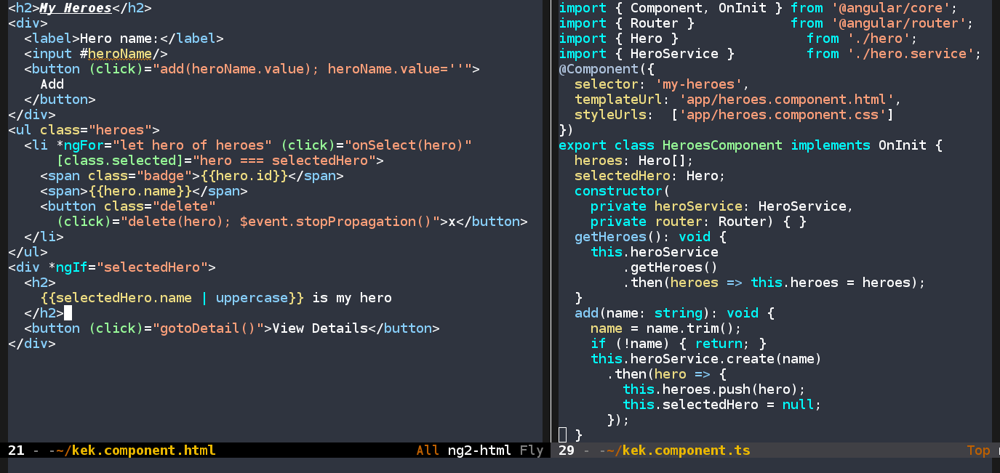

[](http://melpa.org/#/ng2-mode)
# ng2-mode
The Angular 2+ support Emacs needs


## Features
- Syntax highlighting
- Syntactic indentation
- Data binding macros
- [typescript-mode](https://github.com/ananthakumaran/typescript.el) integration
- [tide](https://github.com/ananthakumaran/tide) integration

## Dependencies
- [typescript-mode](https://github.com/ananthakumaran/typescript.el) is required for typescript editing support

## Installation
Install this package with `M-x package-install RET ng2-mode`, and adding the following to your `init.el` file:
``` emacs-lisp
(require 'ng2-mode)
```

## Supported File Types
ng2-ts-mode is automatically activated in `*.component.ts` and `*.service.ts`
ng2.html-mode is automatically activated in `*.component.html`

## Functions
- `ng2-ts-mode` - Enable Angular 2 TypeScript mode
- `ng2-html-mode` - Enable Angular 2 Template mode

## Contributing
If you want to see a function in either mode, feel free to open an issue or a pull request.

## License
GPLv3+
